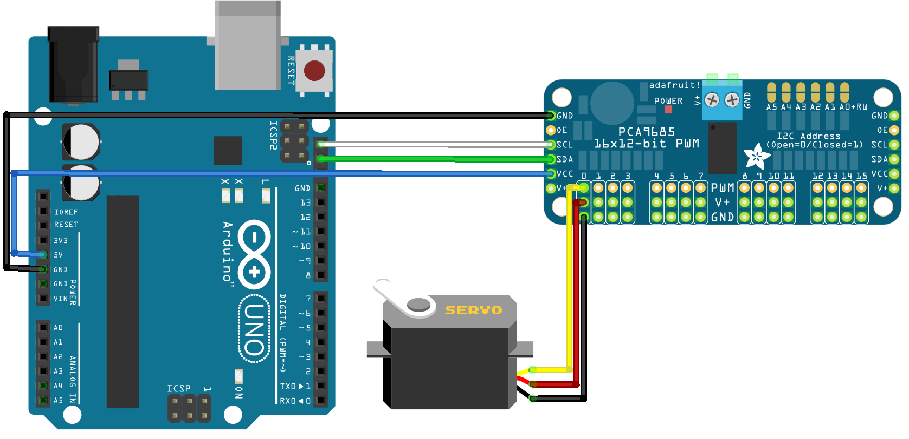

# Flexibot
In this project, a continuum robot is developed with 16 degrees of freedom (16 actuators) integrated with computer vision capabilities. The design of this robot draws inspiration from nature, particularly from snakes, and is tailored for the purpose of collecting cigarette butts from the ground.
## Bringing the Idea to Life
Body:
Initially, I experimented with various body designs, eventually settling on an elastic body with a plastic-polyester texture. This material offers the necessary elasticity for flexibility and sufficient strength to withstand bending and torsion tension. Strong strings are employed as tendons to efficiently transfer the torque generated by the actuators to the main body structure.
Actuators:
To drive the robot’s movements, I utilized 16 MG90S servomotors controlled through an Arduino Uno board in collaboration with a PCA9685 module. Each MG90S servomotor features a 5V power pin, a ground pin, and a PWM pin. Given the limited number of PWM pins on the Arduino Uno board, I integrated the PCA9685 module, which provides 16 additional PWM pins for seamless control of all 16 servomotors.

Sensor:
An important component of this project is the camera sensor employed for tracking the end effector and cigarette butts. By training a model on YOLOv8 with classes for cigarettes and end effectors, the camera effectively detects bounding boxes around these objects. By finding the coordinates of these bounding boxes, the robot can accurately estimate the positions of the detected objects, aided by the fixed positioning of the camera.

<video width="320" height="240" controls>
  <source src="Data/SelfBalancingRobot.gif" type="video/gif">
</video>
